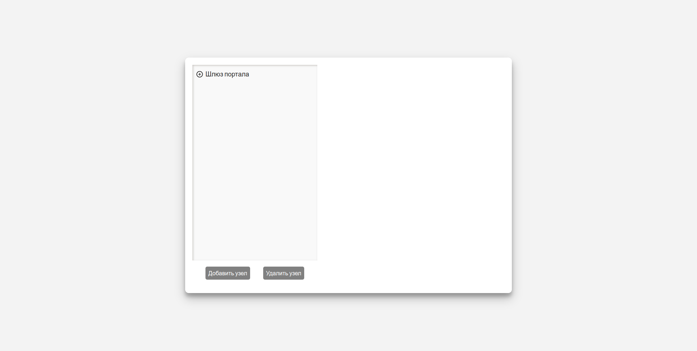
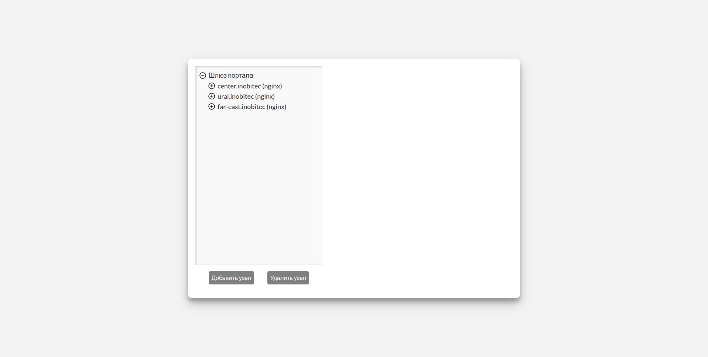

# Тестовое клиент-серверное приложение, визуализирующее дерево сетевых узлов.

---

## Общие сведения

Данное web-приложение выполняет визуализацию дерева сетевых узлов некоторой распределенной системы с микросервисной архитектурой.

Приложение обладает следующими возможностями: создание, хранение, редактирование и удаление узлов.

---

## Разворачивание системы

### Необходимые программы и компоненты

Для установки и запуска решения необходимо наличие:

1. [Docker (v20.10.14)](https://www.digitalocean.com/community/tutorials/how-to-install-and-use-docker-on-ubuntu-20-04-ru)
2. [Docker Compose (v1.26.0)](https://www.digitalocean.com/community/tutorials/how-to-install-and-use-docker-compose-on-ubuntu-20-04-ru)

### Последовательность установки

1. Зайти в корневую папку приложения, где расположен файл _docker-compose.yml_
1. Открыть терминал и запустить команду
   `docker-compose up`
1. После установки приложение будет доступно на _http://localhost:3050_

## Проверка работоспособности web-приложения

1.  Используя любой браузер перейти на адрес http://localhost:3050.
    В случае успеха в окне браузера откроется стартовая страница
    
2.  При нажатии на кнопку рядом с именем узла (круг с плюсом внутри) должен открыться список дочерних узлов первого уровня
    
3.  При нажати на имя узла в правой части должна появиться детальная информация о нем
    
4.  При успешном редактировании детальной информации об узле кнопка **Применить** станет активной.

    

    Корректными считаются значения:

-   Поля не должны быть пустыми
-   У значений отсутствуют пробелы по краям
-   Для поля 'IP-адрес' корректными считаются значения, соответствующие виду XXX.XXX.XXX.XXX, где XXX - числовое значение от 0 до 255, что соответствует виду IPv4
-   Для поля 'Web-порт' корректными считаются значения от 0 до 65535

    В случае, если в каком-то из полей была допущена ошибка, то информация о ней появится под полем ввода
    

5. При нажатии на кнопку **Применить** информация об узле обновляется на сервере. В случае успешного обновления должно появиться сообщение "Узел успешно обновлен".

    

    Если обновленная информация совпадает с уже существующей, т.е. имеет такой же набор из имени, ip-адреса и номера web-порта, то под формой должно появиться сообщение "Узел с такими данными уже существует". После этого необходимо исправить данные и повторно отправить их на сервер

    

6. При нажатии на кнопку **Отмена** форма для ввода данных должна исчезнуть

7. При нажатии на кнопку **Добавить узел** должно появиться модальное окно с формой для ввода данных нового узла. Чтобы закрыть его нужно нажать на кнопку **Отмена**.
   
   После введения корректных данных кнопка **Подтвердить** станет активной
   
8. При нажатии на кнопку **Подтвердить** данные о новом узле отправляются на сервер. После успешного добавления нового узла должно закрыться модальное окно и появиться сообщение "Узел успешно добавлен"
   
   Если добавляемая информация совпадает с уже существующей, т.е. имеет такой же набор из имени, ip-адреса и номера web-порта, то под формой должно появиться сообщение "Узел с такими данными уже существует". После этого мы должны исправить данные и повторно нажать на кнопку **Подтвердить**.
   
9. При нажатии на кнопку **Удалить** должно появиться модальное окно с предупреждением о том, что будут удалены также и все его дочерние узлы. Чтобы закрыть модальное окно нужно нажать на кнопку **Отмена**.
   
10. При нажатии на кнопку **Продолжить** произойдет удаление узла вместе со всеми его дочерними узлами и модальное окно закроется.
